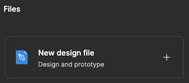
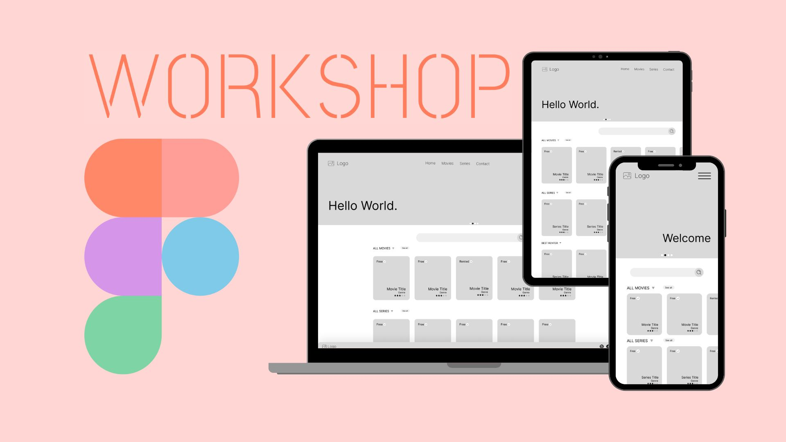
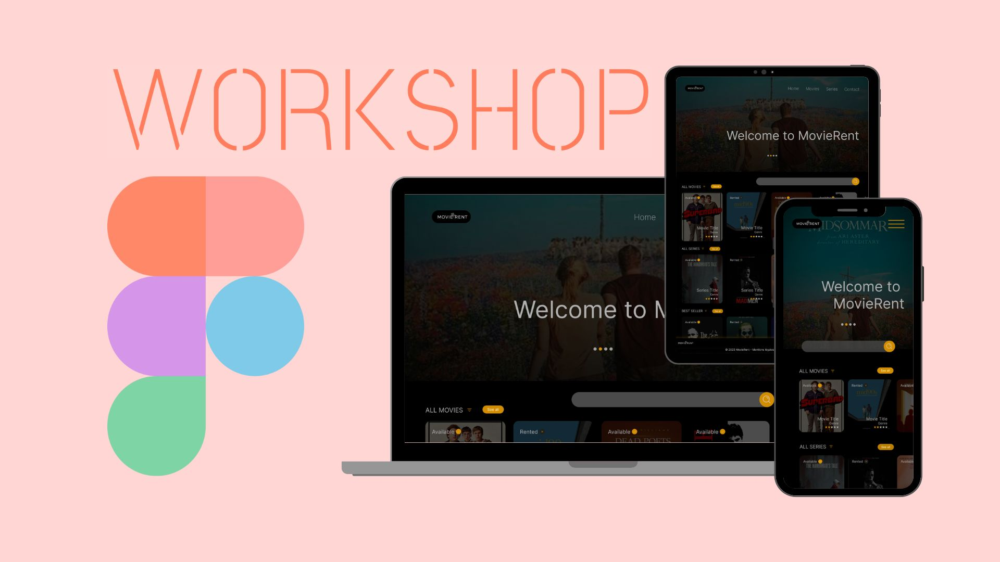

# Figma Workshop 

## Learning objectives :  
Understand the basic Figma functionalities (frames, components, prototypes, assets, …).
Create responsive and user-friendly designs (UX/UI).
Understand how to easily build wireframes and final designs.

## Getting started : 
1. Create an account : [Figma SignUp/SignIn Page](https://www.figma.com/)  
2. Go to you personal dashboard

3. Create a new file  

3. Rename the file  

4. Start project Movie Rent

## Tools | Plugins : 
- Figma account 
- Desktop/Browser app 
- Iconur - Line Icon Set (Plugin)

## The Procject :
This workshop is part of a series of workshops whose objective is to cover the entire process of building a web development project:

### **A static movie rental website.**

This first workshop consists in creating the design of this website with a consistent and responsive UX approach. It will be declined in 2 main phases, starting with the structuring of the design, the wireframe, followed by the second part which is the building of the final visual including graphic design. 
Each part will require the implementation of frames, components and prototypes.

1. Wireframe 
    - build homepage 
    - create the required components
    - build menu 
    - build single page 
    - build prototypes

2. Layout 
    - build homepage 
    - create the required components
    - build menu 
    - build single page 
    - build prototypes
		

### For more 
If you want to reproduce the the entire movieRent project, you can access it [here](https://www.figma.com/file/7G7oqEFYVhmENWdgDzOsKc/MovieRent-App-Wireframe?node-id=0%3A1&t=29guQUfH7kpp9Vnn-0).